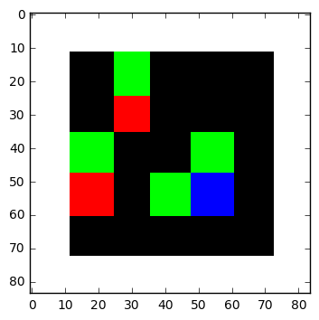
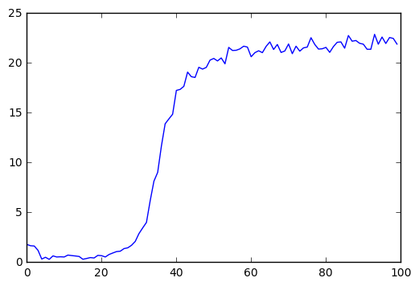

```python
import numpy as np
import random
import tensorflow as tf
import itertools
import scipy.misc
import matplotlib.pyplot as plt
import os

from skimage.transform import  resize
%matplotlib inline
```


```python
class gameOb():
    def __init__(self,coordinates, size, intensity, channel, reward, name):
        self.x = coordinates[0]
        self.y = coordinates[1]
        self.size = size
        self.intensity = intensity
        self.channel = channel
        self.reward = reward
        self.name = name
```


```python
class gameEnv():
    def __init__(self,size):
        self.sizeX = size
        self.sizeY = size
        self.actions = 4
        self.objects = []
        a = self.reset()
        plt.imshow(a,interpolation = "nearest")
    def reset(self):
        self.objects = []
        hero = gameOb(self.newPosition(),1,1,2,None,'hero')
        self.objects.append(hero)
        goal = gameOb(self.newPosition(),1,1,1,1,'goal')
        self.objects.append(goal)
        hole = gameOb(self.newPosition(),1,1,0,-1,'fire')
        self.objects.append(hole)
        goal2 = gameOb(self.newPosition(),1,1,1,1,'goal')
        self.objects.append(goal2)
        hole2 = gameOb(self.newPosition(),1,1,0,-1,'fire')
        self.objects.append(hole2)
        goal3 = gameOb(self.newPosition(),1,1,1,1,'goal')
        self.objects.append(goal3)
        goal4 = gameOb(self.newPosition(),1,1,1,1,'goal')
        self.objects.append(goal4)
        
        state = self.renderEnv()
        self.state = state
        return state
        
    def moveChar(self,direction):
        hero = self.objects[0]
        heroX = hero.x
        heroY = hero.y
        if direction == 0 and hero.y >=1:
            hero.y -= 1
        if direction == 1 and hero.y <=self.sizeY-2:
            hero.y += 1
            
        if direction == 3 and hero.x >=1:
            hero.x -= 1
        if direction == 1 and hero.x <=self.sizeX-2:
            hero.x += 1
            
        self.objects[0] = hero
        
    def newPosition(self):
        iterables = [range(self.sizeX),range(self.sizeY)]
        points = []
        for t in itertools.product(*iterables):
            points.append(t)
            
        currentPositions = []
        for objectA in self.objects:
            if(objectA.x,objectA.y) not in currentPositions:
                currentPositions.append((objectA.x,objectA.y))
                
        for pos in currentPositions:
            points.remove(pos)
            
        location = np.random.choice(range(len(points)),replace = False)
        return points[location]
    
    def checkGoal(self):
        others = []
        for obj in self.objects:
            if obj.name == 'hero':
                hero = obj
            else:
                others.append(obj)
                
        for other in others:
            if hero.x == other.x and hero.y == other.y:
                self.objects.remove(other)
                if other.reward == 1:
                    self.objects.append(gameOb(self.newPosition(),1,1,1,1,'goal'))
                else:
                    self.objects.append(gameOb(self.newPosition(),1,1,0,-1,'fire'))
                    
                return other.reward,False
        return 0.0,False
    
    def renderEnv(self):
        a = np.ones([self.sizeY +2,self.sizeX + 2,3])
        a[1:-1,1:-1,:] = 0
        hero = None
        
        for item in self.objects:
            a[item.y +1 :item.y+item.size +1,\
              item.x +1:item.x+item.size+1,\
              item.channel] = item.intensity
        b = scipy.misc.imresize(a[:,:,0],[84,84,1],interp ="nearest")
        c = scipy.misc.imresize(a[:,:,1],[84,84,1],interp ="nearest")
        d = scipy.misc.imresize(a[:,:,2],[84,84,1],interp ="nearest")
        
        a = np.stack([b,c,d],axis = 2)
        return a
    
    def step(self,action):
        self.moveChar(action)
        reward,done = self.checkGoal()
        state = self.renderEnv()
        return state, reward, done
```


```python
env = gameEnv(size = 5)
```

    C:\Program Files\Anaconda3\lib\site-packages\ipykernel\__main__.py:89: DeprecationWarning: `imresize` is deprecated!
    `imresize` is deprecated in SciPy 1.0.0, and will be removed in 1.2.0.
    Use ``skimage.transform.resize`` instead.
    C:\Program Files\Anaconda3\lib\site-packages\ipykernel\__main__.py:90: DeprecationWarning: `imresize` is deprecated!
    `imresize` is deprecated in SciPy 1.0.0, and will be removed in 1.2.0.
    Use ``skimage.transform.resize`` instead.
    C:\Program Files\Anaconda3\lib\site-packages\ipykernel\__main__.py:91: DeprecationWarning: `imresize` is deprecated!
    `imresize` is deprecated in SciPy 1.0.0, and will be removed in 1.2.0.
    Use ``skimage.transform.resize`` instead.
    





```python
class Qnetwork():
    def __init__(self,h_size):
        self.scalarInput = tf.placeholder(shape=[None,21168],\
                                         dtype = tf.float32)
        self.imageIn = tf.reshape(self.scalarInput,shape = [-1,84,84,3])
        
        self.conv1 = tf.contrib.layers.convolution2d(\
                inputs = self.imageIn,\
                num_outputs =32,\
                kernel_size =[8,8],\
                stride = [4,4],\
                padding = 'VALID',\
                biases_initializer = None)
        
        self.conv2 = tf.contrib.layers.convolution2d(\
                inputs = self.conv1,\
                num_outputs =64,\
                kernel_size =[4,4],\
                stride = [2,2],\
                padding = 'VALID',\
                biases_initializer = None)
        
        self.conv3 = tf.contrib.layers.convolution2d(\
                inputs = self.conv2,\
                num_outputs =64,\
                kernel_size =[3,3],\
                stride = [1,1],\
                padding = 'VALID',\
                biases_initializer = None)
        
        self.conv4 = tf.contrib.layers.convolution2d(\
                inputs = self.conv3,\
                num_outputs =512,\
                kernel_size =[7,7],\
                stride = [1,1],\
                padding = 'VALID',\
                biases_initializer = None)
        
        self.streamAC,self.streamVC = tf.split(self.conv4,2,3)
        self.streamA = tf.contrib.layers.flatten(self.streamAC)
        self.streamV = tf.contrib.layers.flatten(self.streamVC)
        
        self.AW = tf.Variable(tf.random_normal([h_size//2,env.actions]))
        self.VW = tf.Variable(tf.random_normal([h_size//2,1]))
        self.Advantage = tf.matmul(self.streamA,self.AW)
        self.Value = tf.matmul(self.streamV,self.VW)
        
        self.Qout = self.Value + tf.subtract(self.Advantage,tf.reduce_mean(\
                                    self.Advantage,reduction_indices=1,keep_dims = True))
        self.predict = tf.argmax(self.Qout,1)
        
        self.targetQ = tf.placeholder(shape=[None],dtype = tf.float32)
        self.actions = tf.placeholder(shape=[None],dtype=tf.int32)
        self.actions_onehot = tf.one_hot(self.actions,env.actions,dtype= tf.float32)
        
        self.Q = tf.reduce_sum(tf.multiply(self.Qout,self.actions_onehot),\
                               reduction_indices=1)
        
        self.td_error = tf.square(self.targetQ - self.Q)
        
        self.loss = tf.reduce_mean(self.td_error)
        self.trainer = tf.train.AdamOptimizer(learning_rate=0.0001)
        self.updateModel = self.trainer.minimize(self.loss)
        
```


```python
class experience_buffer():
    def __init__(self,buffer_size = 50000):
        self.buffer = []
        self.buffer_size = buffer_size
        
    def add(self,experience):
        if len(self.buffer) + len(experience) >= self.buffer_size:
            self.buffer[0:(len(experience)+len(self.buffer)) - self.buffer_size] = []
        self.buffer.extend(experience)
        
    def sample(self,size):
        return np.reshape(np.array(random.sample(self.buffer,size)),[size,5])
```


```python
def processState(states):
    return np.reshape(states,[21168])

def updateTargetGraph(tfVars,tau):
    total_vars = len(tfVars)
    op_holder = []
    
    for idx, var in enumerate(tfVars[0:total_vars//2]):
        op_holder.append(tfVars[idx + total_vars//2].assign((var.value()*tau)\
                        +((1- tau)*tfVars[idx + total_vars//2].value())))
    return op_holder

def updateTarget(op_holder,sess):
    for op in op_holder:
        sess.run(op)
```


```python

batch_size = 32
update_freq = 4
y = 0.99
startE = 1
endE = 0.01
anneling_steps = 10000.0
num_episodes = 10000
pre_train_steps = 10000
max_epLength = 50
load_model = False
path = "./dqn"
h_size = 512
tau = 0.001
```


```python
mainQN = Qnetwork(h_size)
targetQN = Qnetwork(h_size)
init = tf.global_variables_initializer()

trainables = tf.trainable_variables()
targetOps = updateTargetGraph(trainables,tau)
```


```python
myBuffer = experience_buffer()
e = startE
stepDrop = (startE - endE) / anneling_steps

rList = []
total_steps = 0

saver = tf.train.Saver()
if not os.path.exists(path):
    os.makedirs(path)
```


```python
with tf.Session() as sess:
    if load_model == True:
        print("Loading Model...")
        ckpt = tf.train.get_checkpoint_state(path)
        saver.restore(sess,ckpt.model_checkpoint_path)
        
    sess.run(init)
    
    updateTarget(targetOps,sess)
    for i in range(num_episodes + 1):
        epsiodeBuffer = experience_buffer()
        s = env.reset()
        s = processState(s)
        d = False
        rAll = 0
        j = 0
        while j < max_epLength:
            j += 1
            if np.random.rand(1) < e or total_steps < pre_train_steps:
                a = np.random.randint(0,4)
            else:
                a = sess.run(mainQN.predict,feed_dict=\
                            {mainQN.scalarInput:[s]})[0]
            s_,r,d = env.step(a)
            s_ = processState(s_)
            total_steps += 1
            epsiodeBuffer.add(np.reshape(np.array([s,a,r,s_,d]),[1,5]))

            if total_steps > pre_train_steps:
                if e>endE:
                    e -= stepDrop
                if total_steps %(update_freq) == 0:
                    trainBatch = myBuffer.sample(batch_size)
                    A = sess.run(mainQN.predict,feed_dict =\
                                {mainQN.scalarInput:np.vstack(trainBatch[:,3])})
                    Q = sess.run(targetQN.Qout,feed_dict=\
                                {targetQN.scalarInput:np.vstack(trainBatch[:,3])})
                    doubleQ = Q[range(batch_size),A]
                    targetQ = trainBatch[:,2] + y*doubleQ
                    _ = sess.run(mainQN.updateModel,feed_dict=\
                                {mainQN.scalarInput:np.vstack(trainBatch[:,0]),\
                                mainQN.targetQ:targetQ,mainQN.actions:trainBatch[:,1]})
                    updateTarget(targetOps,sess)
            rAll += r
            s = s_

            if d == True:
                break
                
        myBuffer.add(epsiodeBuffer.buffer)
        rList.append(rAll)

        if i > 0 and i%25 == 0:
            print("episode",i,", average reward of last 25 episode",\
                  np.mean(rList[-25:]))

        if i > 0 and i % 1000 == 0:
            saver.save(sess,path + '/model-'+str(i)+'.cptk')
            print("Saved Model")
            
    saver.save(sess,path + '/model-'+str(i)+'.cptk')
                        
```

    C:\Program Files\Anaconda3\lib\site-packages\ipykernel\__main__.py:89: DeprecationWarning: `imresize` is deprecated!
    `imresize` is deprecated in SciPy 1.0.0, and will be removed in 1.2.0.
    Use ``skimage.transform.resize`` instead.
    C:\Program Files\Anaconda3\lib\site-packages\ipykernel\__main__.py:90: DeprecationWarning: `imresize` is deprecated!
    `imresize` is deprecated in SciPy 1.0.0, and will be removed in 1.2.0.
    Use ``skimage.transform.resize`` instead.
    C:\Program Files\Anaconda3\lib\site-packages\ipykernel\__main__.py:91: DeprecationWarning: `imresize` is deprecated!
    `imresize` is deprecated in SciPy 1.0.0, and will be removed in 1.2.0.
    Use ``skimage.transform.resize`` instead.
    

    episode 25 , average reward of last 25 episode 1.08
    episode 50 , average reward of last 25 episode 1.44
    episode 75 , average reward of last 25 episode 2.04
    episode 100 , average reward of last 25 episode 2.48
    episode 125 , average reward of last 25 episode 2.36
    episode 150 , average reward of last 25 episode 1.44
    episode 175 , average reward of last 25 episode 1.56
    episode 200 , average reward of last 25 episode 1.2
    episode 225 , average reward of last 25 episode 1.32
    episode 250 , average reward of last 25 episode 2.12
    episode 275 , average reward of last 25 episode 1.72
    episode 300 , average reward of last 25 episode 1.52
    episode 325 , average reward of last 25 episode 1.56
    episode 350 , average reward of last 25 episode 1.28
    episode 375 , average reward of last 25 episode 1.28
    episode 400 , average reward of last 25 episode 0.6
    episode 425 , average reward of last 25 episode 0.16
    episode 450 , average reward of last 25 episode 0.4
    episode 475 , average reward of last 25 episode 0.16
    episode 500 , average reward of last 25 episode 0.56
    episode 525 , average reward of last 25 episode 0.24
    episode 550 , average reward of last 25 episode 0.36
    episode 575 , average reward of last 25 episode 0.56
    episode 600 , average reward of last 25 episode 0.84
    episode 625 , average reward of last 25 episode 0.16
    episode 650 , average reward of last 25 episode 0.4
    episode 675 , average reward of last 25 episode 0.6
    episode 700 , average reward of last 25 episode 0.0
    episode 725 , average reward of last 25 episode 0.6
    episode 750 , average reward of last 25 episode 1.04
    episode 775 , average reward of last 25 episode 0.44
    episode 800 , average reward of last 25 episode 0.48
    episode 825 , average reward of last 25 episode 0.24
    episode 850 , average reward of last 25 episode 0.32
    episode 875 , average reward of last 25 episode 1.08
    episode 900 , average reward of last 25 episode 0.48
    episode 925 , average reward of last 25 episode 0.48
    episode 950 , average reward of last 25 episode 0.8
    episode 975 , average reward of last 25 episode 0.64
    episode 1000 , average reward of last 25 episode 0.24
    Saved Model
    episode 1025 , average reward of last 25 episode 0.56
    episode 1050 , average reward of last 25 episode 0.48
    episode 1075 , average reward of last 25 episode 0.48
    episode 1100 , average reward of last 25 episode 0.6
    episode 1125 , average reward of last 25 episode 0.52
    episode 1150 , average reward of last 25 episode 0.68
    episode 1175 , average reward of last 25 episode 0.76
    episode 1200 , average reward of last 25 episode 0.96
    episode 1225 , average reward of last 25 episode 1.2
    episode 1250 , average reward of last 25 episode 0.52
    episode 1275 , average reward of last 25 episode 0.6
    episode 1300 , average reward of last 25 episode 0.36
    episode 1325 , average reward of last 25 episode 0.4
    episode 1350 , average reward of last 25 episode 0.76
    episode 1375 , average reward of last 25 episode 0.56
    episode 1400 , average reward of last 25 episode 0.8
    episode 1425 , average reward of last 25 episode 0.68
    episode 1450 , average reward of last 25 episode 0.72
    episode 1475 , average reward of last 25 episode 0.36
    episode 1500 , average reward of last 25 episode 0.56
    episode 1525 , average reward of last 25 episode 0.48
    episode 1550 , average reward of last 25 episode 0.44
    episode 1575 , average reward of last 25 episode 0.08
    episode 1600 , average reward of last 25 episode 0.16
    episode 1625 , average reward of last 25 episode 0.68
    episode 1650 , average reward of last 25 episode 0.08
    episode 1675 , average reward of last 25 episode 0.28
    episode 1700 , average reward of last 25 episode 0.52
    episode 1725 , average reward of last 25 episode 0.4
    episode 1750 , average reward of last 25 episode 0.52
    episode 1775 , average reward of last 25 episode 0.52
    episode 1800 , average reward of last 25 episode 0.44
    episode 1825 , average reward of last 25 episode 0.56
    episode 1850 , average reward of last 25 episode 0.48
    episode 1875 , average reward of last 25 episode 0.56
    episode 1900 , average reward of last 25 episode 0.16
    episode 1925 , average reward of last 25 episode 0.6
    episode 1950 , average reward of last 25 episode 0.92
    episode 1975 , average reward of last 25 episode 0.48
    episode 2000 , average reward of last 25 episode 0.84
    Saved Model
    episode 2025 , average reward of last 25 episode 0.52
    episode 2050 , average reward of last 25 episode 0.96
    episode 2075 , average reward of last 25 episode 0.6
    episode 2100 , average reward of last 25 episode 0.4
    episode 2125 , average reward of last 25 episode 0.6
    episode 2150 , average reward of last 25 episode 0.12
    episode 2175 , average reward of last 25 episode 0.8
    episode 2200 , average reward of last 25 episode 0.68
    episode 2225 , average reward of last 25 episode 0.76
    episode 2250 , average reward of last 25 episode 1.12
    episode 2275 , average reward of last 25 episode 0.4
    episode 2300 , average reward of last 25 episode 0.8
    episode 2325 , average reward of last 25 episode 0.72
    episode 2350 , average reward of last 25 episode 0.6
    episode 2375 , average reward of last 25 episode 1.04
    episode 2400 , average reward of last 25 episode 1.4
    episode 2425 , average reward of last 25 episode 1.2
    episode 2450 , average reward of last 25 episode 0.8
    episode 2475 , average reward of last 25 episode 1.12
    episode 2500 , average reward of last 25 episode 1.12
    episode 2525 , average reward of last 25 episode 0.68
    episode 2550 , average reward of last 25 episode 1.64
    episode 2575 , average reward of last 25 episode 1.36
    episode 2600 , average reward of last 25 episode 0.88
    episode 2625 , average reward of last 25 episode 1.48
    episode 2650 , average reward of last 25 episode 1.52
    episode 2675 , average reward of last 25 episode 1.16
    episode 2700 , average reward of last 25 episode 1.2
    episode 2725 , average reward of last 25 episode 1.36
    episode 2750 , average reward of last 25 episode 1.04
    episode 2775 , average reward of last 25 episode 1.52
    episode 2800 , average reward of last 25 episode 1.96
    episode 2825 , average reward of last 25 episode 1.68
    episode 2850 , average reward of last 25 episode 1.32
    episode 2875 , average reward of last 25 episode 1.96
    episode 2900 , average reward of last 25 episode 1.76
    episode 2925 , average reward of last 25 episode 1.48
    episode 2950 , average reward of last 25 episode 1.84
    episode 2975 , average reward of last 25 episode 2.76
    episode 3000 , average reward of last 25 episode 2.24
    Saved Model
    episode 3025 , average reward of last 25 episode 2.72
    episode 3050 , average reward of last 25 episode 3.08
    episode 3075 , average reward of last 25 episode 3.28
    episode 3100 , average reward of last 25 episode 2.6
    episode 3125 , average reward of last 25 episode 3.4
    episode 3150 , average reward of last 25 episode 3.2
    episode 3175 , average reward of last 25 episode 2.76
    episode 3200 , average reward of last 25 episode 4.52
    episode 3225 , average reward of last 25 episode 3.68
    episode 3250 , average reward of last 25 episode 3.2
    episode 3275 , average reward of last 25 episode 4.68
    episode 3300 , average reward of last 25 episode 4.36
    episode 3325 , average reward of last 25 episode 6.52
    episode 3350 , average reward of last 25 episode 5.24
    episode 3375 , average reward of last 25 episode 5.64
    episode 3400 , average reward of last 25 episode 7.96
    episode 3425 , average reward of last 25 episode 8.0
    episode 3450 , average reward of last 25 episode 8.4
    episode 3475 , average reward of last 25 episode 7.8
    episode 3500 , average reward of last 25 episode 7.88
    episode 3525 , average reward of last 25 episode 8.36
    episode 3550 , average reward of last 25 episode 10.04
    episode 3575 , average reward of last 25 episode 8.8
    episode 3600 , average reward of last 25 episode 8.6
    episode 3625 , average reward of last 25 episode 10.04
    episode 3650 , average reward of last 25 episode 11.12
    episode 3675 , average reward of last 25 episode 12.64
    episode 3700 , average reward of last 25 episode 13.48
    episode 3725 , average reward of last 25 episode 14.32
    episode 3750 , average reward of last 25 episode 13.88
    episode 3775 , average reward of last 25 episode 13.4
    episode 3800 , average reward of last 25 episode 13.48
    episode 3825 , average reward of last 25 episode 14.56
    episode 3850 , average reward of last 25 episode 13.24
    episode 3875 , average reward of last 25 episode 15.08
    episode 3900 , average reward of last 25 episode 15.32
    episode 3925 , average reward of last 25 episode 15.88
    episode 3950 , average reward of last 25 episode 14.52
    episode 3975 , average reward of last 25 episode 14.64
    episode 4000 , average reward of last 25 episode 14.52
    Saved Model
    episode 4025 , average reward of last 25 episode 18.16
    episode 4050 , average reward of last 25 episode 18.52
    episode 4075 , average reward of last 25 episode 15.68
    episode 4100 , average reward of last 25 episode 16.48
    episode 4125 , average reward of last 25 episode 15.44
    episode 4150 , average reward of last 25 episode 18.0
    episode 4175 , average reward of last 25 episode 17.28
    episode 4200 , average reward of last 25 episode 18.68
    episode 4225 , average reward of last 25 episode 17.4
    episode 4250 , average reward of last 25 episode 18.96
    episode 4275 , average reward of last 25 episode 16.2
    episode 4300 , average reward of last 25 episode 18.16
    episode 4325 , average reward of last 25 episode 17.72
    episode 4350 , average reward of last 25 episode 20.44
    episode 4375 , average reward of last 25 episode 18.64
    episode 4400 , average reward of last 25 episode 19.64
    episode 4425 , average reward of last 25 episode 16.68
    episode 4450 , average reward of last 25 episode 20.44
    episode 4475 , average reward of last 25 episode 18.92
    episode 4500 , average reward of last 25 episode 18.28
    episode 4525 , average reward of last 25 episode 18.2
    episode 4550 , average reward of last 25 episode 18.96
    episode 4575 , average reward of last 25 episode 18.44
    episode 4600 , average reward of last 25 episode 18.6
    episode 4625 , average reward of last 25 episode 17.88
    episode 4650 , average reward of last 25 episode 20.8
    episode 4675 , average reward of last 25 episode 19.92
    episode 4700 , average reward of last 25 episode 19.88
    episode 4725 , average reward of last 25 episode 20.2
    episode 4750 , average reward of last 25 episode 19.52
    episode 4775 , average reward of last 25 episode 16.52
    episode 4800 , average reward of last 25 episode 21.16
    episode 4825 , average reward of last 25 episode 20.04
    episode 4850 , average reward of last 25 episode 19.52
    episode 4875 , average reward of last 25 episode 19.0
    episode 4900 , average reward of last 25 episode 20.0
    episode 4925 , average reward of last 25 episode 19.52
    episode 4950 , average reward of last 25 episode 18.4
    episode 4975 , average reward of last 25 episode 22.0
    episode 5000 , average reward of last 25 episode 21.04
    Saved Model
    episode 5025 , average reward of last 25 episode 20.6
    episode 5050 , average reward of last 25 episode 19.16
    episode 5075 , average reward of last 25 episode 21.12
    episode 5100 , average reward of last 25 episode 21.0
    episode 5125 , average reward of last 25 episode 21.04
    episode 5150 , average reward of last 25 episode 19.16
    episode 5175 , average reward of last 25 episode 20.24
    episode 5200 , average reward of last 25 episode 20.52
    episode 5225 , average reward of last 25 episode 19.56
    episode 5250 , average reward of last 25 episode 21.68
    episode 5275 , average reward of last 25 episode 21.0
    episode 5300 , average reward of last 25 episode 19.76
    episode 5325 , average reward of last 25 episode 19.76
    episode 5350 , average reward of last 25 episode 21.4
    episode 5375 , average reward of last 25 episode 19.36
    episode 5400 , average reward of last 25 episode 19.2
    episode 5425 , average reward of last 25 episode 20.6
    episode 5450 , average reward of last 25 episode 21.44
    episode 5475 , average reward of last 25 episode 22.56
    episode 5500 , average reward of last 25 episode 21.84
    episode 5525 , average reward of last 25 episode 22.04
    episode 5550 , average reward of last 25 episode 21.68
    episode 5575 , average reward of last 25 episode 21.04
    episode 5600 , average reward of last 25 episode 20.0
    episode 5625 , average reward of last 25 episode 21.76
    episode 5650 , average reward of last 25 episode 20.96
    episode 5675 , average reward of last 25 episode 21.72
    episode 5700 , average reward of last 25 episode 20.64
    episode 5725 , average reward of last 25 episode 22.08
    episode 5750 , average reward of last 25 episode 21.8
    episode 5775 , average reward of last 25 episode 20.28
    episode 5800 , average reward of last 25 episode 21.68
    episode 5825 , average reward of last 25 episode 22.28
    episode 5850 , average reward of last 25 episode 21.76
    episode 5875 , average reward of last 25 episode 21.6
    episode 5900 , average reward of last 25 episode 21.24
    episode 5925 , average reward of last 25 episode 21.56
    episode 5950 , average reward of last 25 episode 20.6
    episode 5975 , average reward of last 25 episode 21.6
    episode 6000 , average reward of last 25 episode 22.56
    Saved Model
    episode 6025 , average reward of last 25 episode 20.24
    episode 6050 , average reward of last 25 episode 21.32
    episode 6075 , average reward of last 25 episode 20.48
    episode 6100 , average reward of last 25 episode 20.24
    episode 6125 , average reward of last 25 episode 21.84
    episode 6150 , average reward of last 25 episode 18.96
    episode 6175 , average reward of last 25 episode 21.92
    episode 6200 , average reward of last 25 episode 21.6
    episode 6225 , average reward of last 25 episode 20.8
    episode 6250 , average reward of last 25 episode 21.2
    episode 6275 , average reward of last 25 episode 21.84
    episode 6300 , average reward of last 25 episode 21.16
    episode 6325 , average reward of last 25 episode 21.08
    episode 6350 , average reward of last 25 episode 22.64
    episode 6375 , average reward of last 25 episode 21.24
    episode 6400 , average reward of last 25 episode 19.2
    episode 6425 , average reward of last 25 episode 20.48
    episode 6450 , average reward of last 25 episode 20.12
    episode 6475 , average reward of last 25 episode 22.96
    episode 6500 , average reward of last 25 episode 22.88
    episode 6525 , average reward of last 25 episode 21.16
    episode 6550 , average reward of last 25 episode 23.72
    episode 6575 , average reward of last 25 episode 21.64
    episode 6600 , average reward of last 25 episode 21.92
    episode 6625 , average reward of last 25 episode 20.32
    episode 6650 , average reward of last 25 episode 21.24
    episode 6675 , average reward of last 25 episode 22.64
    episode 6700 , average reward of last 25 episode 21.6
    episode 6725 , average reward of last 25 episode 22.52
    episode 6750 , average reward of last 25 episode 22.04
    episode 6775 , average reward of last 25 episode 22.08
    episode 6800 , average reward of last 25 episode 20.72
    episode 6825 , average reward of last 25 episode 19.44
    episode 6850 , average reward of last 25 episode 20.64
    episode 6875 , average reward of last 25 episode 22.68
    episode 6900 , average reward of last 25 episode 21.4
    episode 6925 , average reward of last 25 episode 22.04
    episode 6950 , average reward of last 25 episode 20.28
    episode 6975 , average reward of last 25 episode 20.64
    episode 7000 , average reward of last 25 episode 21.8
    Saved Model
    episode 7025 , average reward of last 25 episode 22.56
    episode 7050 , average reward of last 25 episode 20.4
    episode 7075 , average reward of last 25 episode 21.44
    episode 7100 , average reward of last 25 episode 22.56
    episode 7125 , average reward of last 25 episode 22.08
    episode 7150 , average reward of last 25 episode 20.44
    episode 7175 , average reward of last 25 episode 19.52
    episode 7200 , average reward of last 25 episode 22.56
    episode 7225 , average reward of last 25 episode 21.96
    episode 7250 , average reward of last 25 episode 21.48
    episode 7275 , average reward of last 25 episode 21.6
    episode 7300 , average reward of last 25 episode 21.52
    episode 7325 , average reward of last 25 episode 21.76
    episode 7350 , average reward of last 25 episode 21.64
    episode 7375 , average reward of last 25 episode 21.52
    episode 7400 , average reward of last 25 episode 19.96
    episode 7425 , average reward of last 25 episode 21.84
    episode 7450 , average reward of last 25 episode 22.68
    episode 7475 , average reward of last 25 episode 21.84
    episode 7500 , average reward of last 25 episode 19.72
    episode 7525 , average reward of last 25 episode 21.28
    episode 7550 , average reward of last 25 episode 21.48
    episode 7575 , average reward of last 25 episode 23.0
    episode 7600 , average reward of last 25 episode 20.8
    episode 7625 , average reward of last 25 episode 21.32
    episode 7650 , average reward of last 25 episode 23.44
    episode 7675 , average reward of last 25 episode 23.52
    episode 7700 , average reward of last 25 episode 21.76
    episode 7725 , average reward of last 25 episode 22.68
    episode 7750 , average reward of last 25 episode 22.0
    episode 7775 , average reward of last 25 episode 21.12
    episode 7800 , average reward of last 25 episode 21.52
    episode 7825 , average reward of last 25 episode 21.68
    episode 7850 , average reward of last 25 episode 21.24
    episode 7875 , average reward of last 25 episode 20.4
    episode 7900 , average reward of last 25 episode 22.36
    episode 7925 , average reward of last 25 episode 21.96
    episode 7950 , average reward of last 25 episode 21.6
    episode 7975 , average reward of last 25 episode 21.24
    episode 8000 , average reward of last 25 episode 20.76
    Saved Model
    episode 8025 , average reward of last 25 episode 21.68
    episode 8050 , average reward of last 25 episode 21.4
    episode 8075 , average reward of last 25 episode 22.24
    episode 8100 , average reward of last 25 episode 21.16
    episode 8125 , average reward of last 25 episode 19.76
    episode 8150 , average reward of last 25 episode 21.72
    episode 8175 , average reward of last 25 episode 21.2
    episode 8200 , average reward of last 25 episode 21.76
    episode 8225 , average reward of last 25 episode 21.6
    episode 8250 , average reward of last 25 episode 20.4
    episode 8275 , average reward of last 25 episode 22.52
    episode 8300 , average reward of last 25 episode 22.2
    episode 8325 , average reward of last 25 episode 21.16
    episode 8350 , average reward of last 25 episode 22.76
    episode 8375 , average reward of last 25 episode 21.24
    episode 8400 , average reward of last 25 episode 22.92
    episode 8425 , average reward of last 25 episode 20.56
    episode 8450 , average reward of last 25 episode 23.68
    episode 8475 , average reward of last 25 episode 21.52
    episode 8500 , average reward of last 25 episode 22.76
    episode 8525 , average reward of last 25 episode 22.0
    episode 8550 , average reward of last 25 episode 22.32
    episode 8575 , average reward of last 25 episode 20.92
    episode 8600 , average reward of last 25 episode 20.68
    episode 8625 , average reward of last 25 episode 22.64
    episode 8650 , average reward of last 25 episode 22.8
    episode 8675 , average reward of last 25 episode 22.64
    episode 8700 , average reward of last 25 episode 23.04
    episode 8725 , average reward of last 25 episode 21.76
    episode 8750 , average reward of last 25 episode 21.76
    episode 8775 , average reward of last 25 episode 22.28
    episode 8800 , average reward of last 25 episode 22.88
    episode 8825 , average reward of last 25 episode 22.68
    episode 8850 , average reward of last 25 episode 22.44
    episode 8875 , average reward of last 25 episode 21.36
    episode 8900 , average reward of last 25 episode 22.64
    episode 8925 , average reward of last 25 episode 22.08
    episode 8950 , average reward of last 25 episode 21.96
    episode 8975 , average reward of last 25 episode 22.68
    episode 9000 , average reward of last 25 episode 21.16
    Saved Model
    episode 9025 , average reward of last 25 episode 21.24
    episode 9050 , average reward of last 25 episode 21.32
    episode 9075 , average reward of last 25 episode 22.08
    episode 9100 , average reward of last 25 episode 22.92
    episode 9125 , average reward of last 25 episode 21.52
    episode 9150 , average reward of last 25 episode 22.4
    episode 9175 , average reward of last 25 episode 20.44
    episode 9200 , average reward of last 25 episode 20.88
    episode 9225 , average reward of last 25 episode 21.76
    episode 9250 , average reward of last 25 episode 22.44
    episode 9275 , average reward of last 25 episode 21.0
    episode 9300 , average reward of last 25 episode 20.4
    episode 9325 , average reward of last 25 episode 23.0
    episode 9350 , average reward of last 25 episode 21.76
    episode 9375 , average reward of last 25 episode 23.04
    episode 9400 , average reward of last 25 episode 23.92
    episode 9425 , average reward of last 25 episode 20.64
    episode 9450 , average reward of last 25 episode 22.64
    episode 9475 , average reward of last 25 episode 23.4
    episode 9500 , average reward of last 25 episode 20.64
    episode 9525 , average reward of last 25 episode 22.28
    episode 9550 , average reward of last 25 episode 22.68
    episode 9575 , average reward of last 25 episode 23.24
    episode 9600 , average reward of last 25 episode 22.28
    episode 9625 , average reward of last 25 episode 20.56
    episode 9650 , average reward of last 25 episode 22.92
    episode 9675 , average reward of last 25 episode 22.52
    episode 9700 , average reward of last 25 episode 22.08
    episode 9725 , average reward of last 25 episode 22.52
    episode 9750 , average reward of last 25 episode 22.48
    episode 9775 , average reward of last 25 episode 22.84
    episode 9800 , average reward of last 25 episode 22.28
    episode 9825 , average reward of last 25 episode 23.16
    episode 9850 , average reward of last 25 episode 22.04
    episode 9875 , average reward of last 25 episode 22.24
    episode 9900 , average reward of last 25 episode 22.36
    episode 9925 , average reward of last 25 episode 20.96
    episode 9950 , average reward of last 25 episode 23.04
    episode 9975 , average reward of last 25 episode 22.52
    episode 10000 , average reward of last 25 episode 21.28
    Saved Model
    


```python
rMat = np.resize(np.array(rList),[len(rList)//100,100])
rMean = np.average(rMat,1)
plt.plot(rMean)
```


    [<matplotlib.lines.Line2D at 0x38a1a7f0>]




